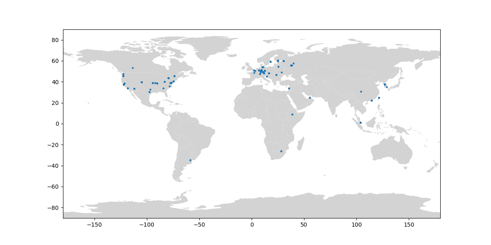

# Kaspa P2P Crawler

This is a repository for research purposes with a limited *(read: wrong)* 
implementation of the Kaspa P2P protocol. The main product of this effort 
is a map of the nodes available to the public.



## Running

For the first run, you should create a virtual env and install the dependencies.

```{shell}
python -m venv venv
. ./venv/bin/activate
pip install -r requirements.txt
```

To run the crawler, run the following command inside the virtual env.
```{shell}
./kaspa_crawler.py -v --token=<ipinfo token>
```

To see the available options, run 
```{shell}
./kaspa_crawler.py -h
```

### Creating a map
 Install the extra dependencies
```{shell}
pip install geopandas pandas matplotlib
./scripts/plot_map.py data/nodes.json
```

### Too Many Open Files / No Sufficient Resources Errors

To handle errors due to too many open files, increase the `ulimit` of your 
system, then run the script.
```{shell}
ulimit -n 22000
```

## Updating Proto Files

Requires wget. Run for the root directory of the repository.

```{shell}
bash scripts/sync_protos.sh
```